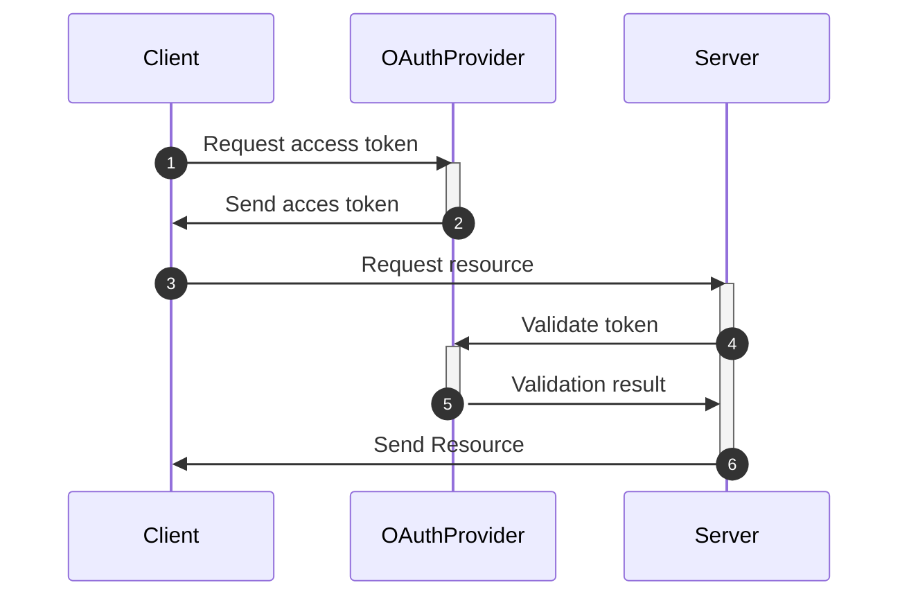

# map-reduce-with-rpc
My implementation of MapReduce library with RPC. 

```mermaid
    sequenceDiagram
    autonumber
    participant Client
    participant OAuthProvider
    participant Server
    Client ->> OAuthProvider: Request access token
    activate OAuthProvider
    OAuthProvider ->> Client: Send acces token
    deactivate OAuthProvider

    Client ->> Server: Request resource
    activate Server
    
    Server ->> OAuthProvider: Validate token
    activate OAuthProvider
    OAuthProvider ->> Server: Validation result
    deactivate OAuthProvider
    Server ->> Client: Send Resource
    deactivate Server


```